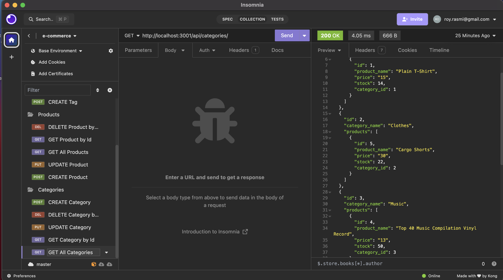
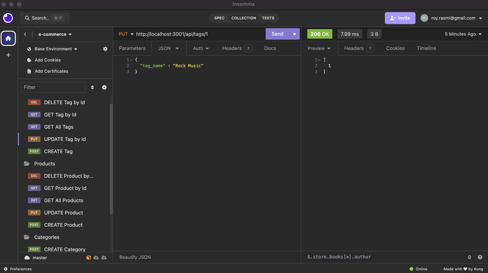
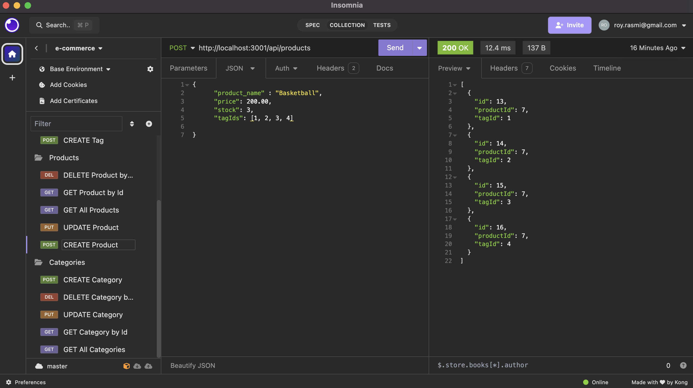

# rasDev-eCommerce

# Description
Built a back end for an e-commerce website. Using Sequelize library to interact with the database. Using Insomnia to test the CURD functions on API routes.

## User Story

AS A manager at an internet retail company
I WANT a back end for my e-commerce website that uses the latest technologies
SO THAT my company can compete with other e-commerce companies

## Acceptance Criteria

GIVEN a functional Express.js API
WHEN I add my database name, PostgreSQL username, and PostgreSQL password to an environment variable file
THEN I am able to connect to a database using Sequelize
WHEN I enter schema and seed commands
THEN a development database is created and is seeded with test data
WHEN I enter the command to invoke the application
THEN my server is started and the Sequelize models are synced to the PostgreSQL database
WHEN I open API GET routes in Insomnia for categories, products, or tags
THEN the data for each of these routes is displayed in a formatted JSON
WHEN I test API POST, PUT, and DELETE routes in Insomnia
THEN I am able to successfully create, update, and delete data in my database

## License

MIT License - The License file is provided here : (./LICENSE)

## Screenshot
 
 

## Github Repository and Demo Link

Github Repository: https://github.com/rasdevworld/rasDev-eCommerce

Demo Links :

https://app.screencastify.com/v2/manage/videos/et7bAVlGscDGspJWW4g5

OR

https://drive.google.com/file/d/1nSItqyJm-j2smWyJ52yX0zcpc7JTJkVH/view

